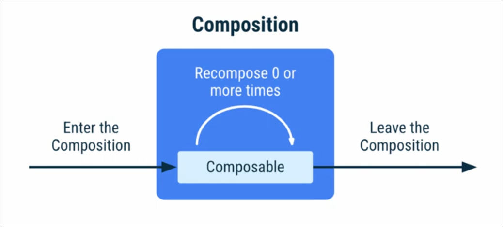

# Jetpack Compose

Jetpack Compose is a modern toolkit for building native Android UI. It simplifies and accelerates UI development on Android with a declarative Kotlin DSL (Domain Specific Language). With Compose, you can create beautiful, responsive, and consistent UIs across different screen sizes and device types, all while writing less code.

## Recomposition

Whenever the state changes, it will recreate the UI

